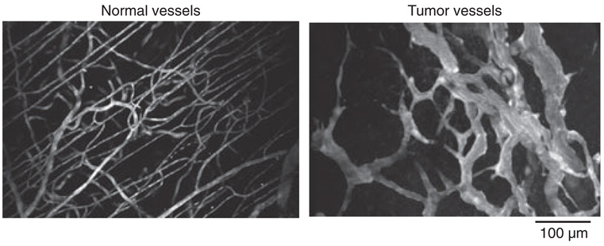

```{r setup, include=FALSE}
knitr::opts_chunk$set(echo=FALSE,message=FALSE,fig.align="center",out.width="70%")
```


background-image:url(http://lab.rockefeller.edu/fuchs/assets/image/3a_SCC.jpg)

---
class: inverse, middle, center

# Vähi mikrokeskkond: strooma

---

## Vähi mikrokeskkond

Kasvajarakud ei eksisteeri organismis isoleeritult, neid ümbritseb kompleksne keskkond, mis koosneb:

.pull-left[

- normaalsetest rakkudest,
- sekreteeritud valkudest,
- füsioloogilistest madalmolekulaarsetest ühenditest (hormoonid),
- veresoontest.

]

.pull-right[

```{r}
knitr::include_graphics("http://www.nature.com/nature/journal/v501/n7467/images/nature12626-f1.jpg")
```

]

.footer[Pilt: Nature.com
]

---

## Kasvajad sisaldavad suures mahus strooma rakke

.pull-left[

```{r, fig.cap="Gupta, 2003. High-magnification photomicrograph of a high-grade ductal carcinoma. Note the diffuse uniform membranous E.cadherin staining (arrows) of the tumor cells."}
knitr::include_graphics("figures/gupta2003.jpg")
```

]

.pull-right[
- E-kadheriini antikehaga värvitud rinnavähi koelõigud. E-kadheriini ekspresseerivaid vähirakke ümbritseb rohkelt stroomarakke.  
]

---

## Kasvajad sisaldavad suures mahus strooma rakke

.pull-left[
- PINCH/LIMS2 on ekspresseeritud kasvajate stroomas, *adapter protein in a cytoplasmic complex linking beta-integrins to the actin cytoskeleton*
- (A) Normaalne eesnääre ja (B) eesnäärme kartsinoom 
- (C) Käärsool ja käärsoole kartsinoom
- (D) Käärsoole kartsinoomi suurendus, PINCH-positiivsed rakud on fibroblastoidse morfoloogiaga
- (E) Normaalne nahk. E, epidermis; F, karvafolliikul; D, strooma fibroblastid  
- (F) Lamerakuline naha kartsinoom
- (G) Kopsu adenokartsinoom
]

.pull-right[

```{r, fig.cap="Wang-Rodriguez, 2002. PINCH protein is present in normal stroma in low abundance but is up-regulated in the stroma associated with common carcinomas."}
knitr::include_graphics("figures/pinch.jpg")
```

]

.footer[Pildid: 
<a href="http://onlinelibrary.wiley.com/doi/10.1002/cncr.11332/full">Gupta et al., 2003
</a>
ja 
<a href="http://onlinelibrary.wiley.com/doi/10.1002/cncr.10878/full">Wang-Rodriguez et al., 2002.
</a>
]

???


---

## Kasvajad sisaldavad suures mahus strooma rakke

.pull-left[
- Kõige sagedasemad vähitüübid nagu rinna, käärsoole, mao ja pankrease kartsinoomid sisaldavad kuni 90% mitte-neoplastilisi rakke.
- Hodgkinsi lümfoomis on üksikud neoplastilised tsütokiine sekreteerivad **Reed-Steinbergi rakud** ümbritsetud 99% normaalsetest lümfotsüütidest.
]

.pull-right[
```{r}
knitr::include_graphics("http://upload.wikimedia.org/wikipedia/commons/3/33/Hodgkin_Disease,_Reed-Sternberg_Cell.jpg")
```

]

.footer[
Pilt: Wikimedia.
]

---

## Kasvaja mikrokeskonnas resideeruvad rakutüübid

- Lisaks neoplastilistele rakkudele leidub vähis erinevas proportsioonis normaalseid rakke:
- T lümfotsüüdid, B lümfotsüüdid, NK ja NKT rakud, makrofaagid (TAM), müeloidset päritolu suppressor-rakud (MDSC), dendriitrakud, neutrofiilid, fibroblastid, müofibroblastid, adipotsüüdid, endoteelirakud, peritsüüdid, lümfoid-endoteel.


```{r}
knitr::include_graphics("http://www.nature.com/nm/journal/v19/n11/images/nm.3394-F1.jpg")
```


.footer[Pilt: 
<a href="http://dx.doi.org/10.1038/nm.3394">Quail & Joyce, 2013.
</a>
]

---

## Fibrotsüüdid, nuumrakud, silelihasrakud

.pull-left[

- Ülemiste hingamisteede kartsinoomis (HNSCC) on erinevat tüüpi rakke: 
    - CD34+ fibrotsüüdid (inaktiivsed fibroblastid) normaalses (A) ülemiste hingamisteede stroomas ja kartsinoomi (üleval paremal) ümbritsemas (B).
    - $\alpha$-SMA+ silelihasrakud (C) ja CD117+ nuumrakud (D) vähi stroomas.
    - CD117+ nuumrakud normaalses stroomas (E) ja kartsinoomis (F).

]

.pull-right[

```{r, fig.cap="hnsccstroma"}
knitr::include_graphics("figures/HNSCCstroma.png")
```

]

.footer[Pilt: 
<a href="http://link.springer.com/content/pdf/10.1007/s00428-003-0965-1.pdf">Barth et al., 2004.
</a>
]

---

## Vähiraku liinide ksenograftid hiires erinevad reaalsetest kasvajatest 

.pull-left[

- Note the **relative uniformity of the HT-29 (A) and SW480 (B) tumors** relative to the primary (C) or PDX tumor (D).


]

.pull-right[

- Patient-derived xenograft (PDX) models of colorectal cancer recapitulate primary tumor heterogeneity.
- Hematoxylin and eosin (H&E) stained slides of xenografts generated by traditional HT-29 (A) or SW480 (B) colorectal cancer cell lines, vs a primary colorectal tumor, SCRX-PDX-CR101-p0 (C), and the same patient’s PDX tumor following passaging through NOD/SCID mice, SCRX-PDX-CR101-p1 (D). 

]

.footer[Pilt: 
<a href="http://www.nature.com/labinvest/journal/v93/n9/full/labinvest201392a.html">Williams et al., 2013.
</a>
]

---
## Mis põhjustab erinevate normaalsete rakutüüpide olemasolu kasvajas

On välja pakutud kaks alternatiivi:

1. Vähis olevad **normaalsed rakud on jäänukid algsest koest** enne tumorigeneesi algust

2. Normaalsete rakkude viibimine kasvajas on tingitud **heterotüüpsest signalisatsioonist**

---

## Heterotüüpne ligand-retseptor signalisatsioon

- Erinevate rakutüüpide vahelist signaliseerimist nimetatakse **heterotüüpseks signalisatsiooniks**

- Heterotüüpne signalisatsioon soodustab või pidurdab kõrvalolevate teiste rakutüüpide jagunemist ja/või ellujäämist

- Näiteks: soole epiteelirakud ekspresseerivad **c-MET retseptorit** aga soole mesenhüüm selle ligandi **HGF/SF kasvufaktorit**


```{r, fig.cap="recip"}
knitr::include_graphics("figures/PDGFA-PDGFR.png")
```

.footer[Pilt: Retsiprookne PDGF-A ja PDGFR-a ekpsressioon testistes. PDGF-A-d ekspresseerivad tubulaarse epiteeli rakud ja PDGF-R ekspresseerivad mesenhümaalsed rakud. 
<a href="http://jcb.rupress.org/content/149/5/1019.full"> Gnessi et al., 2000.
</a>
]


---

## Kasvajarakud kontrollivad stroomat

- Heterotüüpse signalisatsiooni faktorid

    - mitogeensed kasvufaktorid (HGF/SF, VEGF, TGF-a, PDGF),
    
    - kemokiinid (SDF-1/CXCL12, CXCL5)
    
    - kasvu inhibeerivad signaalid (TGF-b),
    
    - troofilised faktorid mis vahendavad ellujäämist (*insulin-like growth factor-1/2* [IGF-1/2]).
    
- **Sarnaselt normaalse epiteeliga kontrollivad ka kartsinoomi rakud ümbritsevaid normaalseid kudesid indutseerides neid kasvama**

- Teistpidi, strooma rakud võivad signaliseerida vähirakkudele ka kasvu pidurdavalt

---

## Heterotüüpsed interaktsioonid mängivad rolli vähi tekkel ja arengus

- **Krooniliste põletike** korral toimivad strooma rakud (makrofaagid, neutrofiilid ja lümfotsüüdid) vähi teket soodustava faktorina kuna loovad pro-inflammatoorse keskkonna (sekreteerivad  TNF-a ja prostaglandiine)

- **Kartsinoomi rakud** sekreteerivad PDGF-i, mille retseptorid on ekspresseeritud strooma rakkudel (fibroblastid, müofibroblastid ja makrofaagid). Strooma rakud sekreteerivad vastusena PDGF-ile IGF-1, mis omakorda soodustab vähirakkude kasvu ja ellujäämist

- **Melanoomid** sekreteerivad samuti PDGF-i, mis indutseerib fibroblastidel IGF-2 sekretsiooni

- **Rinnavähi** rakud sõltuvad strooma fibroblastide poolt sekreteeritud SDF-1/CXCL12 kemokiinist ja HGF/SF-st

---
## Vähi-strooma parakriinne signalisatsioon

```{r, out.width='45%', fig.cap="A model of cancer cell–stromal fibroblast interactions in the cervix. PDGF-BB produced by a cervical cancer cell upregulates HB-EGF through PDGFRβ activation in an adjacent fibroblast, which in turn facilitates cancer cell growth by activating EGFR. HB-EGF also induces PDGF synthesis in the cervical cancer cell. The paracrine loop can be blocked with inhibitors."}
knitr::include_graphics("http://cancerres.aacrjournals.org/content/canres/71/21/6633/F7.large.jpg")
```

.footer[Pilt: ©2011 American Association for Cancer Research.
http://dx.doi.org/10.1158/0008-5472.CAN-11-0034
]

---
class: inverse, middle, center

# Vähk on kui haav mis ei parane

---

## Vähikolle meenutab haava

.pull-left[

- Harold Dvorak avaldas 1986. aastal oma tähelepanekud, et vähikolle meenutab mitmes mõttes haava mis ei suuda paraneda artiklis "*Tumors: Wounds That Do Not Heal*" [HF Dvorak, 1986](http://www.nejm.org/doi/full/10.1056/NEJM198612253152606)

- Haava paranemisel eristatakse **põletikuline faas**, **proliferatiivne faas** ja **küpsemisfaas**

]

.pull-right[

```{r, out.width='100%'}
knitr::include_graphics("http://www.cell.com/cms/attachment/2007952073/2030507092/gr3.jpg")
```

]

.footer[Pilt: cell.com
]


---

### Geeniekspressioon näitab haava fibroblastide ja vähi sarnasust ja on seotud vähipatsientide elulemusega

.pull-left[

```{r}

```

]

.pull-right[

```{r, out.width='100%'}
knitr::include_graphics("http://journals.plos.org/plosbiology/article/file?type=large&id=10.1371/journal.pbio.0020007.g004")
```

]

.footer[Pilt: Gene Expression Signature of Fibroblast Serum Response Predicts Human Cancer Progression: Similarities between Tumors and Wounds
<a href="http://www.plosbiology.org/article/info%3Adoi%2F10.1371%2Fjournal.pbio.0020007">Chang et al., 2004.
</a>
]

---
## Vähk kui haav


.pull-left[

- Haavas vabanev koefaktor (*tissue factor*) käivitab vere koagulatsioonikaskaadi mille tulemusena vere plasma fibrinogeen konverteeritakse trombiini vahendusel fibriiniks ning moodustub haava sulgev klomp

- Fibriin (pruun värvus) naha stroormas ümber rinnavähi naha metastaasi

]

.pull-right[

```{r, fig.cap="Fibriin tuumoris"}
knitr::include_graphics("figures/HIS_1629_f4.gif")
```

]

.footer[Pilt: 
<a href="http://onlinelibrary.wiley.com/doi/10.1046/j.1365-2559.2003.01629.x/full">Colpaert et al., 2003.
</a>
]

---

## Haavas indutseeritakse epiteelirakkudel EMT

.pull-left[
- Haava paranemise põletikulises faasis fibriinklompi põhjustavad vereliistakud ja seejärel klompi migreeruvad makrofaagid sekreteerivad TGF-b ja TGF-a kasvu faktoreid
- TGF-b põhjustab haava kõrval olevate epiteelirakkude **epiteliaal-mesenhümaalse transformatsiooni** (**EMT**)
- Sellised EMT läbinud epiteelirakud muutuvad müofibroblastideks, migreeruvad fibriinklombi alla ja katavad dermise. 
- Müofibroblastides ekspresseeritav silelihasaktiin põhjustab haava kokku tõmbumise
]

.pull-right[
```{r, out.width='100%'}
knitr::include_graphics("http://bme240.eng.uci.edu/students/07s/ngunn/images/day3_with_text.jpg")
```
]
.footer[Pilt: http://bme240.eng.uci.edu.
]

---

## Epiteliaal-mesenhümaalne transformatsioon (EMT)

- EMT on protsess mille käigus epiteelirakud kaotavad polaarsuse, rakkudevahelised adhesioonid, omandavad amööbse liikumise ja invasiivse võime

- Vähi metastaaside teke on seotud EMT-ga: kartsinoomi rakud kaotavad E-kadheriini ekspressiooni, murravad läbi basaalmembraani, sisenevad vereringesse, moodustavad distaalseid mikrometastaase ja läbivad EMT-le vastupidise protsessi MET (mesenhümaal-epiteliaalne transformatsioon).
- EMT annab vähirakkudele resistentsuse onkogeen-indutseeritud senesentsile. 
- EMT-ga seotud transkriptsioonifaktorid **Twist1, Twist2 ja ZEB1** kaitsevad ka inimese ja hiire fibroblaste senesentsi eest.

---

## Epiteliaal-mesenhümaalne transformatsioon

```{r}
knitr::include_graphics("http://www.nature.com/cr/journal/v19/n2/images/cr20095f1.jpg")
```

.footer[Pilt: TGF-beta-induced epithelial to mesenchymal transition
<a href="http://www.nature.com/cr/journal/v19/n2/full/cr20095a.html">Xu et al., 2009
</a>
]

---
class:inverse, middle, center

# Vähi angiogenees

---

## Hüpoksia 

- Veresooned varustavad kudesid hapniku ja toitainetega

```{r, out.width='50%'}
knitr::include_graphics("http://site.hypoxyprobe.com/images/Hypoxia-green-in-rat-brain-tumor.jpg")
```


.footer[Pilt:hüpoksiline piirkond (roheline) roti ajukasvajas. Punane värv, veresooned.  www.hypoxyprobe.com
]


---
## Kasvaja angiogeneesi paradigma

- Tahked kasvajad ei saa areneda üle 1 mm suuruse ilma angiogeneesi initsieerimata

```{r, out.width='50%'}
knitr::include_graphics("figures/Folkman.jpg")
```

.footer[Pilt: Veresoone poolt ülalpeetavatest vähirakkudest moodustub ring ümber soone. Väljaspool seda ringi on vähirakud suremas/surnud. Dunning roti eesnäärme kartsinoomi ksenograft.
<a href="http://jnci.oxfordjournals.org/content/94/12/883.full.pdf+html">Lynn Hlatky, Philip Hahnfeldt, Judah Folkman, 2002.
</a>
]

---

## Vähi veresooned

- Kasvaja veresooned on heterogeense luumeniga, lekkivad ja ebakorrapärased

```{r, out.width='100%'}

```

.footer[Pilt:
<a href="http://www.ncbi.nlm.nih.gov/pmc/articles/PMC2859831/">Fukumura et al., 2010.
</a>
]

---

## Angiogenic switch

.pull-left[

- Angiogeneesi käivitumine sõltub pro-ja anti-angiogeneetiliste faktorite tasakaalust.
- Pro-angiogeneetilised faktorid on VEGF, bFGF, Ang-2, Bv8.
- Anti-angiogeneetilised faktorid nt. maatriksi komponendid trombospondiin-1 (TSP-1), endostatiin, canstatin, tumstatin. Lahustuvad faktorid interferon-α ja -β (IFN-α and -β), angiostatin.

]

.pull-right[

```{r, out.width='100%'}
knitr::include_graphics("http://ars.els-cdn.com/content/image/1-s2.0-S1044579X09000649-gr1.jpg")
```

]

.footer[Pilt: The angiogenic switch in carcinogenesis
<a href="http://www.sciencedirect.com/science/article/pii/S1044579X09000649">Vanessa Baeriswyl, Gerhard Christofori, 2009.
</a>
]

---
## Angiogenees enne ja pärast vähi invasiivseks muutumist

.pull-left[
- Mitteinvasiivne

```{r}

```
]

.pull-right[

- Invasiivne

```{r}

```
]

.footer[Pilt: Tumor Angiogenesis and Metastasis — Correlation in Invasive Breast Carcinoma
<a href="http://www.nejm.org/doi/full/10.1056/NEJM199101033240101#t=articleResults.">Noel Weidner, M.D., Joseph P. Semple, M.D., William R. Welch, M.D., and Judah Folkman, M.D. N Engl J Med 1991; 324:1-8. DOI: 10.1056/NEJM199101033240101
</a>
]


---

## Veresoonte arv seostub halvema elulemusega rinnavähis

```{r, out.width='40%'}
knitr::include_graphics("http://cancerres.aacrjournals.org/content/64/9/2941/F1.medium.gif")
```

.footer[Pilt: 
<a href="http://cancerres.aacrjournals.org/content/64/9/2941.long">Uzzan et al., 2004.
</a>
]

---

## VEGF ekspressioon vähis on seotud elulemusega

```{r, fig.cap=""}
knitr::include_graphics("http://clincancerres.aacrjournals.org/content/10/5/1706/F1.large.jpg")
```

.footer[Pilt: 
<a href="http://clincancerres.aacrjournals.org/content/10/5/1706.long">Konecny et al., 2004.
</a>
]

---
class: inverse, middle, center

# Metastaasid

---

## Metastaas

- Vähi kollete levimine algsest primaarsest paikmest keha teistesse osadesse

- Selliseid sekundaarseid vähikoldeid nimetatakse __vähi siireteks ehk metastaasideks__

- Vähi siire koosneb rakkudest mis on sarnased vähirakkudele algses paikmes

---

## Vähk on evolutsiooniline protsess

```{r, fig.cap=""}
knitr::include_graphics("http://cancerres.aacrjournals.org/content/70/14/5649/F5.large.jpg")
```

---

## Metastaaside klonaalse selektsiooni mudel

- Tegemist on nö. "Darwinliku selektsiooni" protsessiga. 
- Klassikalise klonaalse selektsiooni mudeli kohaselt moodustavad metastaase **algses vähis asuvad minoorsed rakud**.
- Selline haruldane rakukloon selekteeritakse sekundaarses paikmes ja ta suudab ekspandeeruda/kasvada.
- **Eksisteerivad spetsiifilised metastaasi mutatsioonid/geenid**.

```{r}
knitr::include_graphics("figures/Fidler1977.png")
```

.footer[Pilt:  Isaiah J. Fidler and Margaret L. Kripke, 
<a href="http://162.105.160.3/main/2011course/class%202/Fidler%20Kripke%201977.pdf">1977
</a>
]

---

## Alternatiivne mudel

- Metastaasi potentsiaal on suuremas osas algses vähimassis olemas

- Vähi metastaseerumise ennustab algse vähimassi geeniekspressioon.

.pull-left[

- Rinnavähi halva prognoosi geenimuster *'poor prognosis' signature*. 
- Halva prognoosi geenimuster sisaldab geene mis reguleerivad rakutsüklit, invasiooni ja angiogeneesi.
- **Metastaseerumise põhjustavad samad onkogeensed stiimulid/geenid, mis põhjustasid ka algse vähi tekke**.

]

.pull-right[

```{r}
knitr::include_graphics("http://www.nature.com/nature/journal/v415/n6871/images/415530a-f2.2.jpg")
```

]

.footer[Pilt:  Gene expression profiling predicts clinical outcome of breast cancer. 
<a href="http://www.nature.com/nature/journal/v415/n6871/full/415530a.html">van 't Veer et al., 2002.
</a>
]

---

<header>
```{r}
knitr::include_graphics("http://img2.wikia.nocookie.net/__cb20130805012715/wingsoffire/images/3/34/Lemony_Snickets_A_Series_of_Unfortunate_Events_Lemony_Snickets_A_Series_Of_Un.png")
```
</header>

## Metastaseerumise protsess
Kliiniliselt detekteeritava metastaasi tekkeks peab toimuma terve rida juhuslikke sündmusi

- Metastaseerumise käigus peavad vähirakud kõigepealt organismis laiali kanduma ja  uutes asukohtades ellu jääma ning hiljem suutma jaguneda et moodustuks sekundaarne vähk. 
- Protsess sisaldab 
    - vähirakkude migreerumist, 
    - lokaalset ivasiooni, 
    - sisenemist vereringesse, 
    - arresteerumist sekundaarses koes ja veresoonest väljumist ning 
    - lõpuks uue koloonia moodustamist.
- Koloniseerumine omakorda eeldab mitmeid samme, nagu vähirakkude ellujäämist, mikrometastaaside moodustumist, pikaajalise latentsusperioodi üleelamine ja kasvu reaktiveerimine.

---

## Metastaasi etapid

```{r, fig.cap="mets"}
knitr::include_graphics("http://www.cell.com/cms/attachment/2009273093/2032282111/gr1.jpg")
```


.footer[Pilt: Metastasis Steps and Bottlenecks. Sakari Vanharanta, Joan Massagué, 
<a href="http://www.cell.com/cancer-cell/fulltext/S1535-6108(13)00417-0">2013
</a>
]

---

### Tsütokeratiin positiivsed rinnavähi mikrometastaasid regionaalses lümfisõlmes.

```{r, fig.cap=""}
knitr::include_graphics("http://img.medscape.com/fullsize/migrated/479/961/ajcp479961.fig1b.jpg")
```

.footer[Pilt: 
<a href="http://ajcp.ascpjournals.org/content/121/5/637.long">
Ouellette et al., 2004.
</a>
]


---

## Metastaaside organotropismi määravad faktorid

```{r, fig.cap=""}
knitr::include_graphics("figures/gr2_lrg.jpg")
```

.pull-left[

- Organ-spetsiifilist levikut määravad faktorid.
    - Vereringe muster.
    - Endoteeli omadused.
    - Ellujäämis niššid.

]

.pull-right[

- Organ-spetsiifilist kolonisatsiooni määravad faktorid.
    - Latentsus ja reaktivatsioonisignaalid.
    - Stroomarakkude signalisatsioon.
    - Teraapia vastus.

]
   
.footer[Pilt: Metastasis Steps and Bottlenecks. Sakari Vanharanta, Joan Massagué, 
<a href="http://www.cell.com/cancer-cell/fulltext/S1535-6108(13)00417-0">2013
</a>
]


---

## Metastaasi ebaefektiivsus

.pull-left[

- Tuumorist lahkub vereringesse igapäevaselt tuhandeid vähirakke.
- Kliinilise metastaasi moodustavad ainult väga väikene osa vereringesse sisenenud vähirakke.

]

.pull-right[

```{r danila, echo=FALSE, warning=FALSE, results='asis'}
danila <- data.frame(CTC = factor(c("0-2","3-4","5-9","10-50","≥51"),
              levels = c("0-2","3-4","5-9","10-50","≥51")),
              Patients = c(30,13,15,25,29))
library(ggplot2)
library(ggthemes)
ggplot(danila,aes(CTC, (Patients/120)*100, label = CTC, group = 1)) +
  geom_point() +
  geom_text(hjust = 0, nudge_x = 0.05) +
  geom_line(linetype = 3) +
  labs(title = "Vereringes olevad vähirakud",
       subtitle = "Eesnäärmevähi patsiendid (n=120)",
       caption = "Danila et al. (2007)",
       x = "Tsirkuleerivaid vähirakke 7.5 ml veres",
       y = "% patsiente") +
  theme_tufte()

```

]

.footer[Pildi andmed: 
<a href="http://clincancerres.aacrjournals.org/content/13/23/7053.full">
Danila et al., 2007.
</a>
]

---

## Kolonisatsioon on metastaseeruvate vähirakkude peamine pudelikael

.pull-left[

- Suur osa sekundaarsesse koesse jõudnud vähirakkudest ei jagune ja jäävad dormantsesse seisundisse.

]

.pull-right[

```{r}
knitr::include_graphics("http://www.ncbi.nlm.nih.gov/pmc/articles/PMC1853000/bin/jh0981430006.jpg")
```
]

.footer[Pilt: 
<a href="http://www.ncbi.nlm.nih.gov/pmc/articles/PMC1853000/">
Luzzi et al., 1998.
</a>
]

---

## *Seed and soil* hüpotees

- Komplementaarne kahe eelneva mudeliga

.pull-left[

```{r, fig.cap="paget"}
knitr::include_graphics("http://www.nature.com/nrc/journal/v3/n6/images/nrc1098-f1.jpg")
```

]

.pull-right[

- 1889. a. pakkus Inglise kirurg Stephen Paget välja nn. *seed and soil* hüpoteesi, mis tänapäevaselt tähendab, et **vähirakud annavad metastaasi kui nad satuvad sobivasse koe mikrokeskkonda**.
]

---

## Metastaasigeenid

- Primaarses kasvajas ekspresseeritavad metastaasigeenid annavad vähile

- **lokaalse kasvueelise**: EREG (epiregulin) ja COX2/PTGS2 ekspressioon stimuleerib angiogeneesi. Kollageeni krosslinkivat aktiivsust omav LOX (lüsüül oksüdaas) indutseerib vähirakkude migratsiooni ja angiogeneesi;
- **distaalse eelise** mingisse kindlasse organisse infiltreerumiseks: hüpoksia ja TGF-$\beta$ indutseeritud ANGPL4 indutseerib veresoonte läbilaskvuse ja võimaldab siseneda distaalsesse koesse.


```{r}

```

.footer[Pilt: Metastasis: From dissemination to organ-specific colonization.
<a href="http://www.nature.com/scitable/content/metastasis-from-dissemination-to-organ-specific-colonization-14019153">
Don X. Nguyen, Paula D. Bos and Joan Massagué, 2009.
</a>.
]

---
## EMT ja metastaasid: normaalses arengus toimivad geenid

- EMT reguleerivad TF: E47/E2A ja Twist (bHLH), Snail ja Slug (C2H2 zf), FOXC2 (winged helix, forkhead), Goosegoid (paired homeodomain), etc.

```{r, fig.cap="slug"}
knitr::include_graphics("http://d2qiws50qrj9uc.cloudfront.net/content/develop/134/6/1061/F2.large.jpg?width=800&height=600&carousel=1")
```

  
.footer[Pilt: dynamic pattern of Lvsnail mRNA expression during sea urchin development. [The Snail repressor is required for PMC ingression in the sea urchin embryo](http://dev.biologists.org/content/134/6/1061)
]

---
## EMT ja metastaasid: Snail, Slug

```{r, fig.cap="snail"}
knitr::include_graphics("http://d2qiws50qrj9uc.cloudfront.net/content/develop/132/14/3151/F3.large.jpg?width=800&height=600&carousel=1")
```


.footer[Pilt: Snail genes are a convergence point in EMT induction.
[The Snail genes as inducers of cell movement and survival: implications in development and cancer](http://dev.biologists.org/content/132/14/3151)
]

---
## Snaili märklaudgeenid

```{r, fig.cap="snail2"}
knitr::include_graphics("http://d2qiws50qrj9uc.cloudfront.net/content/develop/132/14/3151/F4.large.jpg?width=800&height=600&carousel=1")
```


.footer[Pilt: Downstream targets of Snail.
[The Snail genes as inducers of cell movement and survival: implications in development and cancer](http://dev.biologists.org/content/132/14/3151)
]

---

```{r, fig.cap="emt TGFbeta"}
knitr::include_graphics("http://www.nature.com/onc/journal/v25/n54/images/1209701f2.jpg")
```

.footer[Pilt: **Raf plus TGFbold italic beta-dependent EMT is initiated by endocytosis and lysosomal degradation of E-cadherin**.
Janda et al., 2006. RafER-induced MAPK activation cooperates with TGFbeta to induce an EMT-like phenotype in RafER EpH4 cells. Confluent RafER cells (clone R5) analysed 48 h after treatment with TGFbeta (2.5 ng/ml), or RafER activation by 4HT (0.1 mu M) or both (TGFbeta plus 4HT). (a–d) Phase-contrast microphotographs; (e–h) confocal images of cell layers on filters stained for E-cadherin (green) and vimentin (red). Narrow panels at the bottom and left border of panels: Z sections through stained cell layers generated from stacks of approx40 XY images. Arrows indicate the apical side of the epithelial layer. Bar, 50 mum. (i–l) RafER cells (clone R5) were analysed 6 days after treatment with TGFbeta (2.5 ng/ml), 4HT (0.1 mu M) or both. Immunofluorescence analysis after staining for E-cadherin (green) and vimentin (red) is shown. Nuclei (DNA) were stained with DAPI (blue). Bar on images h and l, 20 mum.
]


---

```{r, fig.cap="emt"}
knitr::include_graphics("http://www.nature.com/article-assets/npg/srep/2016/160420/srep24606/images_hires/w926/srep24606-f1.jpg")
```


---
## Vähirakkude sisenemist vereringesse vahendavad makrofaagid

- Perivaskulaarsed makrofaagid loovad vähis metastaatilise mikrokeskonna (*tumor microenvironment of metastasis*).
- **Vähirakkude ja makrofaagide vahel toimub EGF/CSF-1 parakriinne signalisatsioon**.
- Vähirakkude poolt sekreteeritav CSF-1 indutseerib vähi makrofaagidel EGF-i ekspressiooni, mis positiivse tagasisidena omakorda indutseerib vähirakkudel veelgi CSF-1 ekspressiooni.

```{r}
knitr::include_graphics("http://cancerres.aacrjournals.org/content/69/7/3221/F6.medium.gif")
```


.footer[Pilt: Hernandez et al., 
<a href="http://cancerres.aacrjournals.org/content/69/7/3221.long">
2009
</a>.
]

---

## Vähirakkude intravaseerumine

<div align="center">
<video width="640" height="390" 
src="figures/movie.mp4#t=45" 
controls>
</video>
</div>

.footer[Video: www.metastat.com
]

---

## Metastaasi mustrid: organid

.pull-left[

- Kasvajad mis annavad metastaase peamiselt ühte organisse:
    - eesnäärmevähid luudesse;
    - silma melanoom maksa;
    - sarkoomid kopsu.
- Erinevatesse organitesse metastaseeruvad:
    - kolmik-negatiivsed rinnavähid;
    - naha melanoomid;
    - kopsuvähid;
    - neeruvähid.

]

.pull-right[

```{r, fig.cap="wiki"}
knitr::include_graphics("http://upload.wikimedia.org/wikipedia/commons/thumb/7/7e/Metastasis_sites_for_common_cancers.svg/640px-Metastasis_sites_for_common_cancers.svg.png")
```

]

.footer[Pilt: wikipedia
]

---

## Tüüpilised tahkete kasvajate metastaasikohad

Vähitüüp | Põhilised metastaasi kohad
------------|--------------------------------
Rind | luu, kopsud, maks ja aju
Kopsu adenokartsinoom | aju, luud, neerupealsed ja maks
Naha melanoom | kopsud, aju, nahk, maks
Käärsool | maks ja kopsud
Kõhunääre | maks ja kopsud
Eesnääre | luud
Sarkoom | kopsud
Silma melanoom | maks

.footer[Tabel: Metastasis: From dissemination to organ-specific colonization.
<a href="http://www.nature.com/scitable/content/metastasis-from-dissemination-to-organ-specific-colonization-14019153">
Don X. Nguyen, Paula D. Bos and Joan Massagué, 2009.
</a>.
]

---

## Metastaasi muster: vereringe

.pull-left[

```{r, fig.cap="kops"}
knitr::include_graphics("figures/kops.png")
```

]

.pull-right[

- Kõige esimene organ kuhu südamest välja pumbatav veri jõuab on kopsud.
- Luuüdis ja maksas olev fenestreeritud endoteel on vähirakkudele vereringest väljumiseks permissiivsem kui muudes organites.
- Kopsu endoteel on suhteliselt raskemini läbitav ja 
- kesknärvisüsteemis olev BBB on kõige tugevam barjäär.
- Ometigi umbes 30% metastaatilistest rinnavähkidest annavad ajumetastaase.

]

.footer[Pilt: http://www.uic.edu/classes/bios/bios100/lecturesf04am/lect20.htm
]

---

## Metastaasi muster: vereringe

.pull-left[

```{r}
knitr::include_graphics("http://www.ncbi.nlm.nih.gov/pmc/articles/PMC3043550/bin/nihms268780f3.jpg")
```

]

.pull-right[

- Vereringe määrab **soolekasvajate peamise metastaaside sihtpaigana maksa**,
    - 80% soolevähi korduv patsentidest on maksametastaasid. 
- Maksametastaasid on eelkõige tingitud sellest, et **soolestikust lähtuv portaalveen suubub maksa** ja **maksa endoteel on fenestreeritud**.

]

.footer[Pilt: liver sinusoidal endothelial cell fenestrations.
<a href="http://www.ncbi.nlm.nih.gov/pmc/articles/PMC3043550/">
Cogger et al., 2010.
</a>.
]

---

## Metastaatiline latentsus

- Kliiniliselt on see periood, mis jääb vähi avastamise ja detekteeritavate metastaaside tekke vahele

- Raku tasemel väljendub latentsus 
    - vähiraku jagunemise arrestis ja vaikeolekus (dormantsus);
    - mitteproduktiivses jagunemises, kus jagunemine on balanseeritud apoptoosi poolt;
    - tüvirakuliste omaduste kadumine (*loss of stem cell fitness/stemness*).


---

## Metastaatilise latentsuse kadu: VCAM-1 vahendatud osteoklastide värbamine

- Rinnavähi mudelis on leitud, et sellisest dormantsusest väljunud luu mikrometastaasid on hakanud ekspresseerima enda pinnal VCAM-1 molekuli [Lu et al., 2011](http://www.ncbi.nlm.nih.gov/pmc/articles/PMC3241854/).
- VCAM-1 ekspressioon värbab dormantse vähiraku juurde $\alpha 4 \beta 1$ integriine ekspresseerivad monotsüüdid, mis diferentseeruvad luud lagundavateks osteoklastideks. VCAM-1 on $\alpha 4 \beta 1$ integriini ligand mille kaudu lümfotsüüdid arresteeruvad veresoone pinnal.
- Osteoklastide aktiveerumisega vabaneb luu maatriksist rohkelt kasvufaktoreid tekib nö. nõiaring (*vicious cycle*).


```{r, fig.cap="vcam1"}

```

---

## Metastaatilise latentsuse kadu: sekundaarse koe strooma rakud sekreteerivad tüvirakulisust supresseerivat faktorit

- Rinnavähi kopsumetastaasid hakkavad sekreteerima tüvirakulisust pärssiva TGF-$\beta$ perekonna ligandi **BMP4** blokeerivat faktorit **Coco** [Gao et al., 2012](http://www.sciencedirect.com/science/article/pii/S0092867412008720).
- Coco ekspressioon neutraliseerib parakriinse BMP ja võimaldab vähirakkude reaktivatsiooni.

```{r, fig.cap="coco"}
knitr::include_graphics("http://ars.els-cdn.com/content/image/1-s2.0-S0092867412008720-fx1.jpg")
```

---

## Kliiniline metastaasi muster on eri patsientidel ja vähitüüpidel erinev

- Glioblastoomid metastaseeruvad harva.
- Medulloblastoomid metastaseeruvad sagedasti.
- Kopsu- ja kühunäärme kartsinoomid on sagedasti metastaseerunud juba esmasdiagnoosil.
- Rinna- ja eesnäärmevähid reeglina diagnoosimisel metastaseerunud ei ole.
- Umbes 10% patsentidel esineb vähke mille algne paige on määramatu (*cancer of unknown primary origin*, *CUP*).

---

## Metastaaside temporaalne muster

- Kliiniliselt on raske määrata, kui kiiresti konkreetne vähk progresseerub primaarsest kasvajast latentsete siirete tekkeni ja sealt nähtavate metastaasideni.

.pull-left[

- Kõhunäärmekasvajad arvati metastaseeruvat progressiooni varases staadiumis, kuid eksoomi sekveneerimine ja matemaatiline modelleerimine viitab pigem, et kõhunäärmekasvajad pigem avastatakse liiga hilja.
- Rinna ja eesnäärmevähkide puhul tekivad metastaasid vähi arengus vara ja püsivad kaua latentsed.

]

.pull-right[
T1: aeg mis kulub pankrease intraepiteliaalse neoplaasia tekkeks (PanIN). PanIN on ivasiivse vähi eellane. Tavaline vanemaealises populatsioonis. 

```{r}
knitr::include_graphics("http://www.nature.com/nature/journal/v467/n7319/images/nature09515-f3.2.jpg")
```

]

.footer[Pilt: Distant metastasis occurs late during the genetic evolution of pancreatic cancer.
<a href="http://www.nature.com/nature/journal/v467/n7319/full/nature09515.html">
Yachida et al., 2010.
</a>.
]

---

## Veresoontest väljumine

- Veresoontest väljumist soodustavate geenide ekspressioon suurendab vähirakkude laiali kandumist kudedesse ja seega koloniseerimise tõenäosust.

- Rinnavähi aju metastaase näiteks vahendavad COX2, HB-EGF ja ST6GALNAC5 (*α2,6-sialyltransferase*) ([Bos et al., 2009](http://www.nature.com/nature/journal/v459/n7249/full/nature08021.html)).
- COX2 ja HB-EGF-EGFR ekspressioon annab vähirakule "võimenduse" mitte fenestreeritud endoteeli läbimiseks ja ajukoe koloniseerimiseks.
- $\alpha$2,6-sialüültransferaasi ekspressioon põhjustab sialüül-epitoopide ekspressiooni vähiraku pinnal ja võimaldab aju-spetsiifilist infiltratsiooni.

```{r, fig.cap=""}
knitr::include_graphics("figures/nature08021-f4.2.jpg")
```

---

## Heterotroopsetel interaktsioonidel on oluline roll metastaatilisel koloniseerimisel

- Rinnavähi osteolüütilised metastaasid, kus toimub luukude lagundavate osteoklastide aktivatsioon. Vabaneb terve rida maatriksisse deponeeritud kasvufaktoreid.
    - Vähirakud sekreteerivad paratüroidhormoon peptiidi (PTHrP) ja mõjutavad seeläbi osteoblaste (luukude ülesehitavad rakud) sekreteerima RANKL ja mitte sekreteerima RANKL *decoy* retseptorit OPG (osteoprotegerin), mis stimuleerib osteoblaste.
- Rinnavähi ajumetastaasid ekspresseerivad IL1$\beta$, mis aktiveerib astrotsüüdid. Aktiveeritud astrotsüüdid hakkavad ekspresseerima NOTCH ligandi JAGGED, mis stimuleerib omakorda vähirakke ([Xing, 2013](http://embomolmed.embopress.org/content/5/3/384.long)).

```{r, fig.cap=""}
knitr::include_graphics("figures/F2.large.jpg")
```

.footer[Pilt: IL1b ja rinnavähi ajumetastaaside elulemus.
<a href="http://embomolmed.embopress.org/content/5/3/384.long">
Xing et al., 2013.
</a>.
]

---

## Metastaasi mutatsioonid on samad mis primaarse vähiga seotud mutatsioonid

- Pankrease vähi metastaatilised kloonid sisaldavad **KRASG12V, MYC ja CCNE1** geenimutatsioone.
- Neeruvähi metastaasides on muteerunud **TP53, SETD2, KDM5C**.
- ER-positiivse rinnavähi patsiendil 9 a. peale primaarse vähi eemaldamist tekkinud metastaasides oli peamine mutatsioon **ERBB2** amplifikatsioon.
- Basaalset tüüpi rinnavähi primaarse paikme ja metastaaside vahel erinesid ainult mutantsete alleelide sagedused.

---

## Metastaasi signalisatsioon: pahaloomuline lisanõks

- Soolevähi rakkudes on tavaline TGF-$\beta$ raja inaktivatsioon, samas vähirakud ise ekspresseerivad TGF-$\beta$ mis stimuleerib stroomarakkudel makrofaage aktiveeriva IL-11 ekspressiooni.
- Eesnäärmevähi hiire mudelis annavad PTEN ja TP53 inaktivatsioon mitte-agressiivse vähi, kuid lisaks SMAD4 inaktiveerimine viib metastaseeruvate kasvajate tekkeni.
- Nkx2.1 tuumorsupressori muteerumine muudab KRASG12D-TP53-/- rakud metastaatilisteks.  

```{r, out.width='40%'}
knitr::include_graphics("figures/Nkx2-1.png")
```


.footer[Pilt: Nkx2-1 vaigistamine kopsuvähi mudelis suurendab KRASG12D-TP53-/- rakkude kolonisatsioonivõimet.
<a href="http://www.nature.com/nature/journal/v473/n7345/full/nature09881.html">
Winslow et al., 2011.
</a>.
]

---

```{r}
knitr::include_graphics("figures/Metgenes2.png")
```


---
class: inverse, middle, center

# Lingid teistele loengutele

---
class: inverse, middle

.pull-left[ 

- [Sissejuhatav loeng:vähk, haigestumus ja vähitüübid](http://tpall.github.io/onkobioloogia)
- [Viirused ja onkogeenid](http://tpall.github.io/viirused-ja-onkogeenid)
- [Retseptorid](http://tpall.github.io/Retseptorid)
- [Signaalirajad](http://tpall.github.io/Signaalirajad)
- [Tuumorsupressorgeenid](http://tpall.github.io/Tuumorsupressorid)
- [Rakutsüklikontroll](http://tpall.github.io/Rakutsyklikontroll)

]

.pull-right[ 

- [p53 ja apoptoos](http://tpall.github.io/p53-ja-apoptoos)
- [Immortalisatsioon](http://tpall.github.io/Immortalisatsioon)
- [Tumorigenees](http://tpall.github.io/Tumorigenees)
- [Genoomiterviklikkus](http://tpall.github.io/Genoomiterviklikkus)
- [Mikrokeskkond ja metastaas](http://tpall.github.io/Mikrokeskkond-ja-metastaas)
- [Immuunsus](http://tpall.github.io/Immuunsus)
- [Vähiravimid](http://tpall.github.io/Vahiravim)
]
