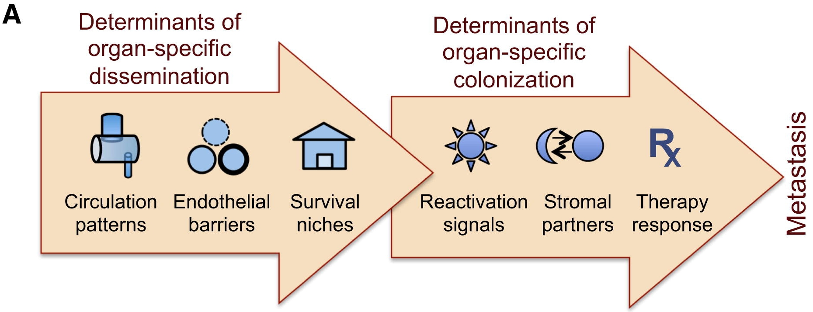
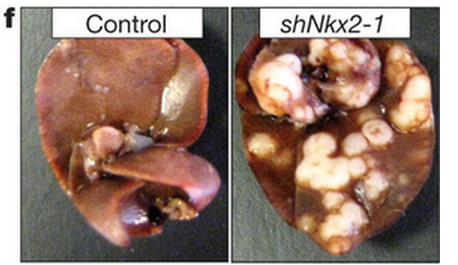

<!-- Limit image width and height -->

<!-- Center image on slide -->

<!-- Italic -->

<!-- Bold -->

--- .segue .dark .nobackground

## Vähi mikrokeskkond: strooma

---- &twocol

## Vähi mikrokeskkond

Kasvajarakud ei eksisteeri organismis isoleeritult, neid ümbritseb kompleksne keskkond, mis koosneb:

***=left

- normaalsetest rakkudest,
- sekreteeritud valkudest,
- füsioloogilistest madalmolekulaarsetest ühenditest (hormoonid),
- veresoontest.

***=right

<footer class="source">Pilt: Nature.com
</footer>

--- &twocol

## Kasvajad sisaldavad suures mahus strooma rakke

***=left

- Vasemal: E-kadheriini antikehaga värvitud rinnavähi koelõigud. E-kadheriini ekspresseerivaid vähirakke ümbritseb rohkelt stroomarakke.  
- Parem: anti-PINCH-positiivne tuumoriga assotseerunud strooma (TAS)

***=right

<footer class="source">Pildid: 
<a href="http://onlinelibrary.wiley.com/doi/10.1002/cncr.11332/full">Gupta et al., 2003
</a>
ja 
<a href="http://onlinelibrary.wiley.com/doi/10.1002/cncr.10878/full">Wang-Rodriguez et al., 2002.
</a>
</footer>

***=pnotes
PINCH/LIMS2 on ekspresseeritud kasvajate stroomas.
- (A) Normaalne eesnääre ja (B) eesnäärme kartsinoom. 
- (C) Käärsool ja käärsoole kartsinoom. 
- (D) Käärsoole kartsinoomi suurendus, PINCH-positiivsed rakud on fibroblastoidse morfoloogiaga. 
- (E) Normaalne nahk. E, epidermis; F, karvafolliikul; D, strooma fibroblastid.  
- (F) Lamerakuline naha kartsinoom.
- (G) Kopsu adenokartsinoom.

---

## Kasvajad sisaldavad suures mahus strooma rakke

- Kõige sagedasemad vähitüübid nagu rinna, käärsoole, mao ja pankrease kartsinoomid sisaldavad kuni 90% mitte-neoplastilisi rakke.
- Hodgkinsi lümfoomis on üksikud neoplastilised tsütokiine sekreteerivad **Reed-Steinbergi rakud** ümbritsetud 99% normaalsetest lümfotsüütidest.

<footer class="source">Pilt: Wikimedia.
</footer>

---

## Kasvaja mikrokeskonnas resideeruvad rakutüübid

Lisaks neoplastilistele rakkudele leidub vähis erinevas proportsioonis normaalseid rakke:
- T lümfotsüüdid, B lümfotsüüdid, NK ja NKT rakud, makrofaagid (TAM), müeloidset päritolu suppressor-rakud (MDSC), dendriitrakud, neutrofiilid, fibroblastid, müofibroblastid, adipotsüüdid, endoteelirakud, peritsüüdid, lümfoid-endoteel.

<footer class="source">Pilt: 
<a href="http://dx.doi.org/10.1038/nm.3394">Quail & Joyce, 2013.
</a>
</footer>

---&twocol

## Fibrotsüüdid, nuumrakud, silelihasrakud

***=left

- Ülemiste hingamisteede kartsinoomis (HNSCC) on erinevat tüüpi rakke: 
    - CD34+ fibrotsüüdid (inaktiivsed fibroblastid) normaalses (A) ülemiste hingamisteede stroomas ja kartsinoomi (üleval paremal) ümbritsemas (B).
    - $\alpha$-SMA+ silelihasrakud (C) ja CD117+ nuumrakud (D) vähi stroomas.
    - CD117+ nuumrakud normaalses stroomas (E) ja kartsinoomis (F).

***=right

<footer class="source">Pilt: 
<a href="http://link.springer.com/content/pdf/10.1007/s00428-003-0965-1.pdf">Barth et al., 2004.
</a>
</footer>

---
## Mis põhjustab erinevate normaalsete rakutüüpide olemasolu kasvajas
# Kuidas saab moos kommi sisse?

On välja pakutud kaks alternatiivi:

1. Vähis olevad **normaalsed rakud on jäänukid algsest koest** enne tumorigeneesi algust.
2. Normaalsete rakkude viibimine kasvajas on tingitud **heterotüüpsest signalisatsioonist**.

---

## Heterotüüpne ligand-retseptor signalisatsioon

- Erinevate rakutüüpide vahelist signaliseerimist nimetatakse **heterotüüpseks signalisatsiooniks**.
- Heterotüüpne signalisatsioon soodustab või pidurdab kõrvalolevate teiste rakutüüpide jagunemist ja/või ellujäämist.
- Näiteks: soole epiteelirakud ekspresseerivad **c-MET retseptorit** aga soole mesenhüüm selle ligandi **HGF/SF kasvufaktorit**. 

<footer class="source">Pilt: Retsiprookne PDGF-A ja PDGFR-a ekpsressioon testistes. PDGF-A-d ekspresseerivad tubulaarse epiteeli rakud ja PDGF-R ekspresseerivad mesenhümaalsed rakud. 
<a href="http://jcb.rupress.org/content/149/5/1019.full"> Gnessi et al., 2000.
</a>
</footer>

---

## Kasvajarakud kontrollivad stroomat

- Heterotüüpse signalisatsiooni faktorid 
    - mitogeensed kasvufaktorid (HGF/SF, VEGF, TGF-$\alpha$, PDGF),
    - kemokiinid (SDF-1/CXCL12, CXCL5)
    - kasvu inhibeerivad signaalid (TGF-$\beta$),
    - troofilised faktorid mis vahendavad ellujäämist (*insulin-like growth factor-1/2* [IGF-1/2]).
- **Sarnaselt normaalse epiteeliga kontrollivad ka kartsinoomi rakud ümbritsevaid normaalseid kudesid indutseerides neid kasvama**.
- Teistpidi, strooma rakud võivad signaliseerida vähirakkudele ka kasvu pidurdavalt.

---

## Heterotüüpsed interaktsioonid mängivad rolli vähi tekkel ja arengus

- **Krooniliste põletike** korral toimivad strooma rakud nagu makrofaagid, neutrofiilid ja lümfotsüüdid vähi teket soodustava faktorina kuna loovad pro-inflammatoorse keskkonna (sekreteerivad  TNF-$\alpha$ ja prostaglandiine).
- **Kartsinoomi rakud** sekreteerivad PDGF-i, mille retseptorid on ekspresseeritud strooma rakkudel - fibroblastid, müofibroblastid ja makrofaagid. Strooma rakud sekreteerivad vastusena PDGF-ile IGF-1, mis omakorda soodustab vähirakkude kasvu ja ellujäämist.
- **Melanoomid** sekreteerivad samuti PDGF-i, mis indutseerib fibroblastidel IGF-2 sekretsiooni.
- **Rinnavähi** rakud sõltuvad strooma fibroblastide poolt sekreteeritud SDF-1/CXCL12 kemokiinist ja HGF/SF-st. 

----

<footer class="source">Pilt: ©2011 American Association for Cancer Research.
<a href="
http://dx.doi.org/10.1158/0008-5472.CAN-11-0034
">Murata et al., 2011.
</a>  A model of cancer cell–stromal fibroblast interactions in the cervix. PDGF-BB produced by a cervical cancer cell upregulates HB-EGF through PDGFRβ activation in an adjacent fibroblast, which in turn facilitates cancer cell growth by activating EGFR. HB-EGF also induces PDGF synthesis in the cervical cancer cell. The paracrine loop can be blocked with inhibitors. 
</footer>

---&twocol

## Vähiraku liinide ksenograftid hiires erinevad reaalsetest kasvajatest 

***=right

- Patient-derived xenograft (PDX) models of colorectal cancer recapitulate primary tumor heterogeneity.
- Hematoxylin and eosin (H&E) stained slides of xenografts generated by traditional HT-29 (A) or SW480 (B) colorectal cancer cell lines, vs a primary colorectal tumor, SCRX-PDX-CR101-p0 (C), and the same patient’s PDX tumor following passaging through NOD/SCID mice, SCRX-PDX-CR101-p1 (D). 

***=left

Note the **relative uniformity of the HT-29 (A) and SW480 (B) tumors** relative to the primary (C) or PDX tumor (D).

<footer class="source">Pilt: 
<a href="http://www.nature.com/labinvest/journal/v93/n9/full/labinvest201392a.html">Williams et al., 2013.
</a>
</footer>

--- &twocol

## Vähk on kui haav mis ei parane

***=left

- Harold Dvorak avaldas 1986. aastal oma tähelepanekud, et vähikolle meenutab mitmes mõttes haava mis ei suuda paraneda artiklis "*Tumors: Wounds That Do Not Heal*" [HF Dvorak, 1986](http://www.nejm.org/doi/full/10.1056/NEJM198612253152606). 
- Haava paranemisel eristatakse **põletikuline faas**, **proliferatiivne faas** ja **küpsemisfaas**.

***=right

<footer class="source">Pilt: cell.com
</footer>

---
## Haava paranemine

<footer class="source">Stages of wound healing.
Wound healing is classically divided into four stages: (A) hemostasis, (B) inflammation, (C) proliferation, and (D) remodeling. Each stage is characterized by key molecular and cellular events and is coordinated by a host of secreted factors that are recognized and released by the cells of the wounding response. A representative subset of major factors are depicted. PDGF, platelet-derived growth factor; TGF, transforming growth factor; FGFs, fibroblast growth factors; IL-1, interleukin-1; TNF, tumor necrosis factor; KGF, keratinocyte growth factor; IGF, insulin-like growth factor; IFN, interferon; VEGF, vascular endothelial growth factor; HGF, hepatocyte growth factor; MMP, matrix metalloproteinase; TIMP, tissue inhibitor of metalloproteinase. [Advances in skin grafting and treatment of cutaneous wounds](http://www.sciencemag.org/content/346/6212/941.full)
</footer>

---&twocol
## Geeniekspressioon näitab haava fibroblastide ja vähi sarnasust

***=left

***=right

<footer class="source">Pilt: Gene Expression Signature of Fibroblast Serum Response Predicts Human Cancer Progression: Similarities between Tumors and Wounds
<a href="http://www.plosbiology.org/article/info%3Adoi%2F10.1371%2Fjournal.pbio.0020007">Chang et al., 2004.
</a>
</footer>

---&twocol

## Vähk kui haav
# Fibriin tuumoris

***=right

***=left

- Haavas vabanev koefaktor (*tissue factor*) käivitab vere koagulatsioonikaskaadi mille tulemusena vere plasma fibrinogeen konverteeritakse trombiini vahendusel fibriiniks ning moodustub haava sulgev klomp. 
- Fibriin (pruun värvus) naha stroormas ümber rinnavähi naha metastaasi.

<footer class="source">Pilt: 
<a href="http://onlinelibrary.wiley.com/doi/10.1046/j.1365-2559.2003.01629.x/full">Colpaert et al., 2003.
</a>
</footer>

---

## Haavas indutseeritakse epiteelirakkudel EMT

- Haava paranemise põletikulises faasis fibriinklompi põhjustavad vereliistakud ja seejärel klompi migreeruvad makrofaagid sekreteerivad TGF-$\beta$ ja TGF-$\alpha$ kasvu faktoreid.
- TGF-$\beta$ põhjustab haava kõrval olevate epiteelirakkude **epiteliaal-mesenhümaalse transformatsiooni** (**EMT**). 
- Sellised EMT läbinud epiteelirakud muutuvad müofibroblastideks, migreeruvad fibriinklombi alla ja katavad dermise. Müofibroblastides ekspresseeritav silelihas aktiin põhjustab haava kokku tõmbamise.

<footer class="source">Pilt: http://bme240.eng.uci.edu.
</footer>

---

## Epiteliaal-mesenhümaalne transformatsioon (EMT)

# EMT on protsess mille käigus epiteelirakud kaotavad polaarsuse, rakkudevahelised adhesioonid, omandavad amööbse liikumise ja invasiivse võime

- Vähi metastaaside teke on seotud EMT-ga: kartsinoomi rakud kaotavad E-kadheriini ekspressiooni, murravad läbi basaalmembraani, sisenevad vereringesse, moodustavad distaalseid mikrometastaase ja läbivad EMT-le vastupidise protsessi MET (mesenhümaal-epiteliaalne transformatsioon).
- EMT annab vähirakkudele resistentsuse onkogeen-indutseeritud senesentsile. 
- EMT-ga seotud transkriptsioonifaktorid **Twist1, Twist2 ja ZEB1** kaitsevad ka inimese ja hiire fibroblaste senesentsi eest.

----

## Epiteliaal-mesenhümaalne transformatsioon

<footer class="source">Pilt: TGF-beta-induced epithelial to mesenchymal transition
<a href="http://www.nature.com/cr/journal/v19/n2/full/cr20095a.html">Xu et al., 2009
</a>
</footer>

---

## Hüpoksia 
# Veresooned varustavad kudesid hapniku ja toitainetega

<footer class="source">Pilt:hüpoksiline piirkond (roheline) roti ajukasvajas. Punane värv, veresooned.  www.hypoxyprobe.com
</footer>

---
## Kasvaja angiogeneesi paradigma
# Tahked kasvajad ei saa areneda üle 1 mm suuruse ilma angiogeneesi initsieerimata

<footer class="source">Pilt: Veresoone poolt ülalpeetavatest vähirakkudest moodustub ring ümber soone. Väljaspool seda ringi on vähirakud suremas/surnud. Dunning roti eesnäärme kartsinoomi ksenograft.
<a href="http://jnci.oxfordjournals.org/content/94/12/883.full.pdf+html">Lynn Hlatky, Philip Hahnfeldt, Judah Folkman, 2002.
</a>
</footer>

---

## Vähi veresooned

- Kasvaja veresooned on heterogeense luumeniga, lekkivad ja ebakorrapärased

<footer class="source">Pilt:
<a href="http://www.ncbi.nlm.nih.gov/pmc/articles/PMC2859831/">Fukumura et al., 2010.
</a>
</footer>

---&twocol

## Angiogenic switch

***=left

- Angiogeneesi käivitumine sõltub pro-ja anti-angiogeneetiliste faktorite tasakaalust.
- Pro-angiogeneetilised faktorid on VEGF, bFGF, Ang-2, Bv8.
- Anti-angiogeneetilised faktorid nt. maatriksi komponendid trombospondiin-1 (TSP-1), endostatiin, canstatin, tumstatin. Lahustuvad faktorid interferon-α ja -β (IFN-α and -β), angiostatin.

***=right

<footer class="source">Pilt: The angiogenic switch in carcinogenesis
<a href="http://www.sciencedirect.com/science/article/pii/S1044579X09000649">Vanessa Baeriswyl, Gerhard Christofori, 2009.
</a>
</footer>

---

## Veresoonte arv seostub halvema elulemusega rinnavähis

<footer class="source">Pilt: 
<a href="http://cancerres.aacrjournals.org/content/64/9/2941.long">Uzzan et al., 2004.
</a>
</footer>

---

## VEGF ekspressioon vähis on seotud elulemusega

<footer class="source">Pilt: 
<a href="http://clincancerres.aacrjournals.org/content/10/5/1706.long">Konecny et al., 2004.
</a>
</footer>

---

## Rakuväline maatriks (ECM)

- vähile on iseloomulik dereguleeritud ECM-i dünaamika: MMP-d, plasmin on tugevalt üle ekspresseeritud
- protelüütline aktiivsus pärit kasvajas resideeruvatest stroomarakkudest sh. TAM-d, CAF-d
- erinevaid kollageene kasvajates oluliselt rohkem
- kasvajad sellest tingituna füüsiliselt jäigemad
- üle-ekspresseeritud proteoglükaanid, CD44: kasvufaktorite presenteerimine

---

## ECM-i arhitektuur on kasvajates oluliselt erinev normaalsest stroomast

- kollageen-I: normaalselt mitte-orienteeritud fibrillide asemel on kollageen rinnakasvajates selgelt lineaarselt orienteeritud
- kasvaja stroomas kollageeni fiibrid tugevalt krosslingitud: lüsüüloksüdaasid (LOX, LOX-like 2)
- krosslingitud ja tugevam maatriks indutseerib EC migratiooni ja angiogeneesi Bignon et al. (2011)

--- .segue .dark .nobackground

## Metastaasid

---

- Vähi kollete levimine algsest primaarsest paikmest keha teistesse osadesse
- Selliseid sekundaarseid vähikoldeid nimetatakse __vähi siireteks ehk metastaasideks__
- Vähi siire koosneb rakkudest mis on sarnased vähirakkudele algses paikmes

---

## Vähk on evolutsiooniline protsess

---

## Metastaaside klonaalse selektsiooni mudel

- Tegemist on nö. "Darwinliku selektsiooni" protsessiga. 
- Klassikalise klonaalse selektsiooni mudeli kohaselt moodustavad metastaase **algses vähis asuvad minoorsed rakud**.
- Selline haruldane rakukloon selekteeritakse sekundaarses paikmes ja ta suudab ekspandeeruda/kasvada.
- **Eksisteerivad spetsiifilised metastaasi mutatsioonid/geenid**.

<footer class="source">Pilt:  Isaiah J. Fidler and Margaret L. Kripke, 
<a href="http://162.105.160.3/main/2011course/class%202/Fidler%20Kripke%201977.pdf">1977
</a>
</footer>

---&twocol

## Alternatiivne mudel
# Metastaasi potentsiaal on suuremas osas algses vähimassis olemas

- Vähi metastaseerumise ennustab algse vähimassi geeniekspressioon.

***=left

- Rinnavähi halva prognoosi geenimuster *'poor prognosis' signature*. 
- Halva prognoosi geenimuster sisaldab geene mis reguleerivad rakutsüklit, invasiooni ja angiogeneesi.
- **Metastaseerumise põhjustavad samad onkogeensed stiimulid/geenid, mis põhjustasid ka algse vähi tekke**.

***=right

<footer class="source">Pilt:  Gene expression profiling predicts clinical outcome of breast cancer. 
<a href="http://www.nature.com/nature/journal/v415/n6871/full/415530a.html">van 't Veer et al., 2002.
</a>
</footer>

---

<header>

</header>

## Metastaseerumise protsess
# Kliiniliselt detekteeritava metastaasi tekkeks peab toimuma terve rida juhuslikke sündmusi

- Metastaseerumise käigus peavad vähirakud kõigepealt organismis laiali kanduma ja  uutes asukohtades ellu jääma ning hiljem suutma jaguneda et moodustuks sekundaarne vähk. 
- Protsess sisaldab 
    - vähirakkude migreerumist, 
    - lokaalset ivasiooni, 
    - sisenemist vereringesse, 
    - arresteerumist sekundaarses koes ja veresoonest väljumist ning 
    - lõpuks uue koloonia moodustamist.
- Koloniseerumine omakorda eeldab mitmeid samme, nagu vähirakkude ellujäämist, mikrometastaaside moodustumist, pikaajalise latentsusperioodi üleelamine ja kasvu reaktiveerimine.

---

## Metastaasi etapid

<footer class="source">Pilt: Metastasis Steps and Bottlenecks. Sakari Vanharanta, Joan Massagué, 
<a href="http://www.cell.com/cancer-cell/fulltext/S1535-6108(13)00417-0">2013
</a>
</footer>

---

# Tsütokeratiin positiivsed rinnavähi mikrometastaasid regionaalses lümfisõlmes.

<footer class="source">Pilt: 
<a href="http://ajcp.ascpjournals.org/content/121/5/637.long">
Ouellette et al., 2004.
</a>
</footer>

---&twocol

## Metastaaside organotropismi määravad faktorid

***=left

- Organ-spetsiifilist levikut määravad faktorid.
    - Vereringe muster.
    - Endoteeli omadused.
    - Ellujäämis niššid.

***=right

- Organ-spetsiifilist kolonisatsiooni määravad faktorid.
    - Latentsus ja reaktivatsioonisignaalid.
    - Stroomarakkude signalisatsioon.
    - Teraapia vastus.
    
<footer class="source">Pilt: Metastasis Steps and Bottlenecks. Sakari Vanharanta, Joan Massagué, 
<a href="http://www.cell.com/cancer-cell/fulltext/S1535-6108(13)00417-0">2013
</a>
</footer>

---&twocol

## Metastaasi ebaefektiivsus

***=left

- Tuumorist lahkub vereringesse igapäevaselt tuhandeid vähirakke.
- Kliinilise metastaasi moodustavad ainult väga väikene osa vereringesse sisenenud vähirakke.

***=right

<footer class="source">Pildi andmed: 
<a href="http://clincancerres.aacrjournals.org/content/13/23/7053.full">
Danila et al., 2007.
</a>
</footer>

---&twocol

## Kolonisatsioon on metastaseeruvate vähirakkude peamine pudelikael

***=left

- Suur osa sekundaarsesse koesse jõudnud vähirakkudest ei jagune ja jäävad dormantsesse seisundisse.

***=right

<footer class="source">Pilt: 
<a href="http://www.ncbi.nlm.nih.gov/pmc/articles/PMC1853000/">
Luzzi et al., 1998.
</a>
</footer>

---&twocol

## *Seed and soil* hüpotees
# Komplementaarne kahe eelneva mudeliga

***=left

***=right

- 1889. a. pakkus Inglise kirurg Stephen Paget välja nn. *seed and soil* hüpoteesi, mis tänapäevaselt tähendab, et **vähirakud annavad metastaasi kui nad satuvad sobivasse koe mikrokeskkonda**.

---

## Metastaasigeenid
# Primaarses kasvajas ekspresseeritavad metastaasigeenid annavad vähile

- **lokaalse kasvueelise**: EREG (epiregulin) ja COX2/PTGS2 ekspressioon stimuleerib angiogeneesi. Kollageeni krosslinkivat aktiivsust omav LOX (lüsüül oksüdaas) indutseerib vähirakkude migratsiooni ja angiogeneesi;
- **distaalse eelise** mingisse kindlasse organisse infiltreerumiseks: hüpoksia ja TGF-$\beta$ indutseeritud ANGPL4 indutseerib veresoonte läbilaskvuse ja võimaldab siseneda distaalsesse koesse.

<footer class="source">Pilt: Metastasis: From dissemination to organ-specific colonization.
<a href="http://www.nature.com/scitable/content/metastasis-from-dissemination-to-organ-specific-colonization-14019153">
Don X. Nguyen, Paula D. Bos and Joan Massagué, 2009.
</a>.
</footer>

---
## EMT ja metastaasid: normaalses arengus toimivad geenid

- EMT reguleerivad TF: E47/E2A ja Twist (bHLH), Snail ja Slug (C2H2 zf), FOXC2 (winged helix, forkhead), Goosegoid (paired homeodomain), etc.

  
<footer class="source">Pilt: dynamic pattern of Lvsnail mRNA expression during sea urchin development. [The Snail repressor is required for PMC ingression in the sea urchin embryo](http://dev.biologists.org/content/134/6/1061)
</footer>

---
## EMT ja metastaasid: Snail, Slug

<footer class="source">Pilt: Snail genes are a convergence point in EMT induction.
[The Snail genes as inducers of cell movement and survival: implications in development and cancer](http://dev.biologists.org/content/132/14/3151)
</footer>

---
## Snaili märklaudgeenid

<footer class="source">Pilt: Downstream targets of Snail.
[The Snail genes as inducers of cell movement and survival: implications in development and cancer](http://dev.biologists.org/content/132/14/3151)
</footer>

---
## Vähirakkude sisenemist vereringesse vahendavad makrofaagid

- Perivaskulaarsed makrofaagid loovad vähis metastaatilise mikrokeskonna (*tumor microenvironment of metastasis*).
- **Vähirakkude ja makrofaagide vahel toimub EGF/CSF-1 parakriinne signalisatsioon**.
- Vähirakkude poolt sekreteeritav CSF-1 indutseerib vähi makrofaagidel EGF-i ekspressiooni, mis positiivse tagasisidena omakorda indutseerib vähirakkudel veelgi CSF-1 ekspressiooni.

<footer class="source">Pilt: Hernandez et al., 
<a href="http://cancerres.aacrjournals.org/content/69/7/3221.long">
2009
</a>.
</footer>

---

## Vähirakkude intravaseerumine

<video width="640" height="390" 
src="assets/img/movie.mp4#t=45" 
controls>
</video>

<footer class="source">Video: www.metastat.com
</footer>

---&twocol

## Metastaasi mustrid: organid

***=left

- Kasvajad mis annavad metastaase peamiselt ühte organisse:
    - eesnäärmevähid luudesse;
    - silma melanoom maksa;
    - sarkoomid kopsu.
- Erinevatesse organitesse metastaseeruvad:
    - kolmik-negatiivsed rinnavähid;
    - naha melanoomid;
    - kopsuvähid;
    - neeruvähid.

***=right

<footer class="source">Pilt: wikipedia
</footer>

---

## Tüüpilised tahkete kasvajate metastaasikohad

Vähitüüp | Põhilised metastaasi kohad
------------|--------------------------------
Rind | luu, kopsud, maks ja aju
Kopsu adenokartsinoom | aju, luud, neerupealsed ja maks
Naha melanoom | kopsud, aju, nahk, maks
Käärsool | maks ja kopsud
Kõhunääre | maks ja kopsud
Eesnääre | luud
Sarkoom | kopsud
Silma melanoom | maks

<footer class="source">Tabel: Metastasis: From dissemination to organ-specific colonization.
<a href="http://www.nature.com/scitable/content/metastasis-from-dissemination-to-organ-specific-colonization-14019153">
Don X. Nguyen, Paula D. Bos and Joan Massagué, 2009.
</a>.
</footer>

--- &twocol

## Metastaasi muster: vereringe

***=left

***=right

- Kõige esimene organ kuhu südamest välja pumbatav veri jõuab on kopsud.
- Luuüdis ja maksas olev fenestreeritud endoteel on vähirakkudele vereringest väljumiseks permissiivsem kui muudes organites.
- Kopsu endoteel on suhteliselt raskemini läbitav ja 
- kesknärvisüsteemis olev BBB on kõige tugevam barjäär.
- Ometigi umbes 30% metastaatilistest rinnavähkidest annavad ajumetastaase.

<footer class="source">Pilt: http://www.uic.edu/classes/bios/bios100/lecturesf04am/lect20.htm
</footer>

---&twocol

## Metastaasi muster: vereringe

***=right

- Vereringe määrab **soolekasvajate peamise metastaaside sihtpaigana maksa**,
    - 80% soolevähi korduv patsentidest on maksametastaasid. 
- Maksametastaasid on eelkõige tingitud sellest, et **soolestikust lähtuv portaalveen suubub maksa** ja **maksa endoteel on fenestreeritud**.

***=left

<footer class="source">Pilt: liver sinusoidal endothelial cell fenestrations.
<a href="http://www.ncbi.nlm.nih.gov/pmc/articles/PMC3043550/">
Cogger et al., 2010.
</a>.
</footer>

---

## Metastaatiline latentsus
# Kliiniliselt on see periood, mis jääb vähi avastamise ja detekteeritavate metastaaside tekke vahele

- Raku tasemel väljendub latentsus 
    - vähiraku jagunemise arrestis ja vaikeolekus (dormantsus);
    - mitteproduktiivses jagunemises, kus jagunemine on balanseeritud apoptoosi poolt;
    - tüvirakuliste omaduste kadumine (*loss of stem cell fitness/stemness*).

---

# Metastaatilise latentsuse kadu: VCAM-1 vahendatud osteoklastide värbamine

- Rinnavähi mudelis on leitud, et sellisest dormantsusest väljunud luu mikrometastaasid on hakanud ekspresseerima enda pinnal VCAM-1 molekuli [Lu et al., 2011](http://www.ncbi.nlm.nih.gov/pmc/articles/PMC3241854/).
- VCAM-1 ekspressioon värbab dormantse vähiraku juurde $\alpha 4 \beta 1$ integriine ekspresseerivad monotsüüdid, mis diferentseeruvad luud lagundavateks osteoklastideks. VCAM-1 on $\alpha 4 \beta 1$ integriini ligand mille kaudu lümfotsüüdid arresteeruvad veresoone pinnal.
- Osteoklastide aktiveerumisega vabaneb luu maatriksist rohkelt kasvufaktoreid tekib nö. nõiaring (*vicious cycle*).

---

# Metastaatilise latentsuse kadu: sekundaarse koe strooma rakud sekreteerivad tüvirakulisust supresseerivat faktorit

- Rinnavähi kopsumetastaasid hakkavad sekreteerima tüvirakulisust pärssiva TGF-$\beta$ perekonna ligandi **BMP4** blokeerivat faktorit **Coco** [Gao et al., 2012](http://www.sciencedirect.com/science/article/pii/S0092867412008720).
- Coco ekspressioon neutraliseerib parakriinse BMP ja võimaldab vähirakkude reaktivatsiooni.

---

## Kliiniline metastaasi muster on eri patsientidel ja vähitüüpidel erinev

- Glioblastoomid metastaseeruvad harva.
- Medulloblastoomid metastaseeruvad sagedasti.
- Kopsu- ja kühunäärme kartsinoomid on sagedasti metastaseerunud juba esmasdiagnoosil.
- Rinna- ja eesnäärmevähid reeglina diagnoosimisel metastaseerunud ei ole.
- Umbes 10% patsentidel esineb vähke mille algne paige on määramatu (*cancer of unknown primary origin*, *CUP*).

---&twocol

## Metastaaside temporaalne muster

Kliiniliselt on raske määrata, kui kiiresti konkreetne vähk progresseerub primaarsest kasvajast latentsete siirete tekkeni ja sealt nähtavate metastaasideni.

***=left

- Kõhunäärmekasvajad arvati metastaseeruvat progressiooni varases staadiumis, kuid eksoomi sekveneerimine ja matemaatiline modelleerimine viitab pigem, et kõhunäärmekasvajad pigem avastatakse liiga hilja.
- Rinna ja eesnäärmevähkide puhul tekivad metastaasid vähi arengus vara ja püsivad kaua latentsed.

***=right
T1: aeg mis kulub pankrease intraepiteliaalse neoplaasia tekkeks (PanIN). PanIN on ivasiivse vähi eellane. Tavaline vanemaealises populatsioonis. 

<footer class="source">Pilt: Distant metastasis occurs late during the genetic evolution of pancreatic cancer.
<a href="http://www.nature.com/nature/journal/v467/n7319/full/nature09515.html">
Yachida et al., 2010.
</a>.
</footer>

---

## Veresoontest väljumine
# Veresoontest väljumist soodustavate geenide ekspressioon suurendab vähirakkude laiali kandumist kudedesse ja seega koloniseerimise tõenäosust.

- Rinnavähi aju metastaase näiteks vahendavad COX2, HB-EGF ja ST6GALNAC5 (*α2,6-sialyltransferase*) ([Bos et al., 2009](http://www.nature.com/nature/journal/v459/n7249/full/nature08021.html)).
- COX2 ja HB-EGF-EGFR ekspressioon annab vähirakule "võimenduse" mitte fenestreeritud endoteeli läbimiseks ja ajukoe koloniseerimiseks.
- $\alpha$2,6-sialüültransferaasi ekspressioon põhjustab sialüül-epitoopide ekspressiooni vähiraku pinnal ja võimaldab aju-spetsiifilist infiltratsiooni.

--- 

# Heterotroopsetel interaktsioonidel on oluline roll metastaatilisel koloniseerimisel

- Rinnavähi osteolüütilised metastaasid, kus toimub luukude lagundavate osteoklastide aktivatsioon. Vabaneb terve rida maatriksisse deponeeritud kasvufaktoreid.
    - Vähirakud sekreteerivad paratüroidhormoon peptiidi (PTHrP) ja mõjutavad seeläbi osteoblaste (luukude ülesehitavad rakud) sekreteerima RANKL ja mitte sekreteerima RANKL *decoy* retseptorit OPG (osteoprotegerin), mis stimuleerib osteoblaste.
- Rinnavähi ajumetastaasid ekspresseerivad IL1$\beta$, mis aktiveerib astrotsüüdid. Aktiveeritud astrotsüüdid hakkavad ekspresseerima NOTCH ligandi JAGGED, mis stimuleerib omakorda vähirakke ([Xing, 2013](http://embomolmed.embopress.org/content/5/3/384.long)).

<footer class="source">Pilt: IL1b ja rinnavähi ajumetastaaside elulemus.
<a href="http://embomolmed.embopress.org/content/5/3/384.long">
Xing et al., 2013.
</a>.
</footer>

---

## Metastaasi mutatsioonid on samad mis primaarse vähiga seotud mutatsioonid

- Pankrease vähi metastaatilised kloonid sisaldavad **KRASG12V, MYC ja CCNE1** geenimutatsioone.
- Neeruvähi metastaasides on muteerunud **TP53, SETD2, KDM5C**.
- ER-positiivse rinnavähi patsiendil 9 a. peale primaarse vähi eemaldamist tekkinud metastaasides oli peamine mutatsioon **ERBB2** amplifikatsioon.
- Basaalset tüüpi rinnavähi primaarse paikme ja metastaaside vahel erinesid ainult mutantsete alleelide sagedused.

---

## Metastaasi signalisatsioon: pahaloomuline lisanõks
# *.., the Bad and the Ugly*

- Soolevähi rakkudes on tavaline TGF-$\beta$ raja inaktivatsioon, samas vähirakud ise ekspresseerivad TGF-$\beta$ mis stimuleerib stroomarakkudel makrofaage aktiveeriva IL-11 ekspressiooni.
- Eesnäärmevähi hiire mudelis annavad PTEN ja TP53 inaktivatsioon mitte-agressiivse vähi, kuid lisaks SMAD4 inaktiveerimine viib metastaseeruvate kasvajate tekkeni.
- Nkx2.1 tuumorsupressori muteerumine muudab KRASG12D-TP53-/- rakud metastaatilisteks.  

<footer class="source">Pilt: Nkx2-1 vaigistamine kopsuvähi mudelis suurendab KRASG12D-TP53-/- rakkude kolonisatsioonivõimet.
<a href="http://www.nature.com/nature/journal/v473/n7345/full/nature09881.html">
Winslow et al., 2011.
</a>.
</footer>

---

---&twocol

## Onkogeense signalisatsiooni amplifikatsioon
# Kolonisatsiooni strateegia: metastaatilist koloniseerimist soodustavad signaaliradasid võimendavad tunnused

***=left

- VCAM-1 ekspressioon rinnavähirakkudes võimendab PI3K-AKT ellujäämis-signaalirada.
- SRC-i aktivatsioon muudab rinnavähi rakkudes PI3K-AKT raja tundlikkuks CXCL12 ja IGF-1 stimulatsioonile.

***=right

<footer class="source">Pilt: Selection of Bone Metastasis Seeds by Mesenchymal Signals in the Primary Tumor Stroma.
<a href="http://www.cell.com/abstract/S0092-8674%2813%2900944-6">
Zhang et al., 2013.
</a>.
</footer>

--- &twocol

## Ekspressioonimärklaudade repertuaari laienemine
# Kolonisatsiooni strateegia, epigeneetiline regulatsioon

- Epigeneetilised muutused nagu histoonide H3K27 demetülatsioon ja DNA demetülatsioon muudavad VHL inaktiveeritud neeruvähis HIF2$\alpha$ märklaudgeenide repertuaari märksa laiemaks: ülesse läheb ka kopsumetastaase soodustavate CXCR4, CYTIP (*Cytohesin 1 Interacting Protein*), LTBP1 ja SLAMF8  geenide ekspressioon ([Vanharanta, 2013](http://www.ncbi.nlm.nih.gov/pmc/articles/PMC3540187/pdf/nihms421555.pdf)).

***=left

- Rinnavähkides muutub mittekodeeriva RNA HOTAIR toimel H3K27me3 muster nii, et represseeritakse metastaasi-supressorgeenide ekspressioon ([Gupta, 2013](http://www.nature.com/nature/journal/v464/n7291/full/nature08975.html)).

***=right

<footer class="source">Pilt: Long non-coding RNA HOTAIR reprograms chromatin state to promote cancer metastasis. Gupta, 2013.
</footer>

---

## Amplification and Expansion of Oncogenic Pathways as Metastatic Traits

<footer class="source">Pilt: 
<a href="http://www.cell.com/cancer-cell/fulltext/S1535-6108(13)00417-0#">
Sakari Vanharanta, Joan Massagué, 2013.
</a>.
</footer>

--- .segue .dark .nobackground

## Lingid teistele loengutele

--- &twocol 

***=left 

- [Sissejuhatav loeng:vähk, haigestumus ja vähitüübid](http://tpall.github.io/onkobioloogia)
- [Viirused ja onkogeenid](http://tpall.github.io/viirused-ja-onkogeenid)
- [Retseptorid](http://tpall.github.io/Retseptorid)
- [Signaalirajad](http://tpall.github.io/Signaalirajad)
- [Tuumorsupressorgeenid](http://tpall.github.io/Tuumorsupressorid)
- [Rakutsüklikontroll](http://tpall.github.io/Rakutsyklikontroll)

***=right 

- [p53 ja apoptoos](http://tpall.github.io/p53-ja-apoptoos)
- [Immortalisatsioon](http://tpall.github.io/Immortalisatsioon)
- [Tumorigenees](http://tpall.github.io/Tumorigenees)
- [Genoomiterviklikkus](http://tpall.github.io/Genoomiterviklikkus)
- [Mikrokeskkond ja metastaas](http://tpall.github.io/Mikrokeskkond-ja-metastaas)
- [Immuunsus](http://tpall.github.io/Immuunsus)
- [Vähiravimid](http://tpall.github.io/Vahiravim)
